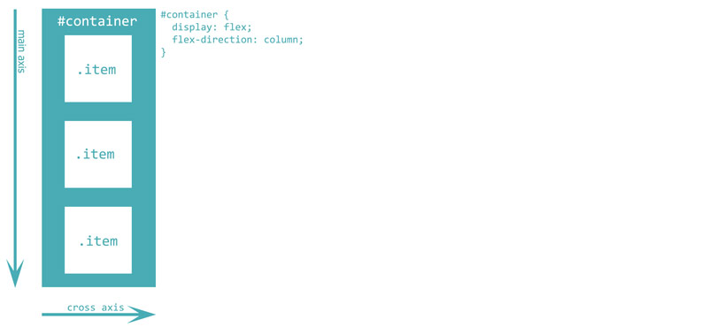
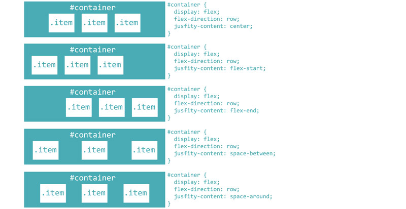
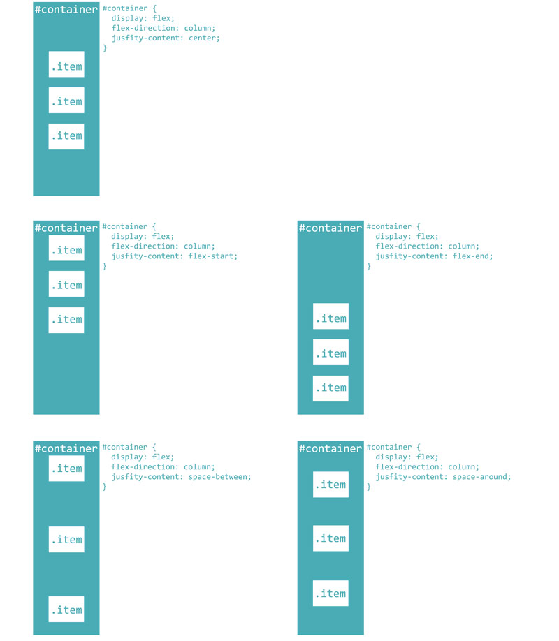

# Visual guide to laying out your content with the CSS flexbox

Introduction: Flexbox provides a very easy and efficient way to lay out, align and distribute content on your page. In this article we will present the different ways flexbox layout can be used to structure a page that displays well on different screen sizes and devices.

Flexbox layout is defined by adding the following CSS rule to the element containing the items that you wish to display flexibly. In the examples below, we have used an id tag "container" to identify the containing element, which holds three elements (or items) within it.

```css
#container {
  display: flex;
}
```

## Arranging items horizontally or vertically with flex-direction
The ``` flex-direction ``` property determines the direction of the main-axis and cross-axis, thus defining the direction in which the flex items are placed. You can think of flex items arranging either horizontally in a row, or vertically in a column.
### Row layout
```css
.container {
    flex-direction: row;
}
```


### Column layout
```css
.container {
    flex-direction: column;
}
```


## Row layout: justify-content


## Column layout: justify-content

