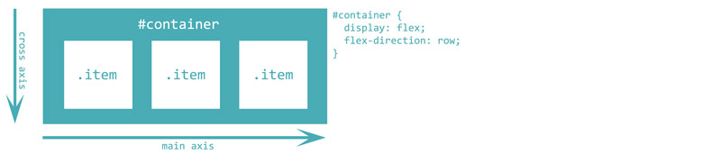

Visual guide to laying out your content with Flexbox

Introduction: Flexbox provides a very easy and efficient way to lay out, align and distribute content on your page. In this article we will present the different ways flexbox layout can be used to structure a page that displays well on different screen sizes and devices.

